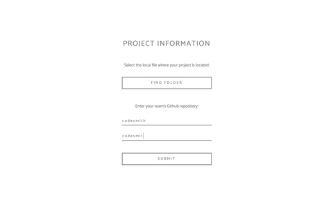

# navigITor

__navigITor__ is a visualization of a team-based Git workflow that updates in real-time when users emit Git events. 



Technologies used in this project include:

  - Electron
  - React
  - Cytoscape
  - RxJS
  - Socket.io
  - Node / Express
  - Webpack
  - SCSS
  - Mocha / Chai

## Installation

#### Grab code and resolve module dependencies

	git clone https://github.com/team-navigitor/naviGITor.git
	cd naviGITor
	npm install

## Developing

First build files and start server
```
npm start
```

#### Run Electron App

Open a new tab
```
npm run electron
```
	
## Testing

	npm run test

## File Structure

#### Client Side

React components will be layed out in the __src__ folder from the root directory.

#### Server Side

Express/Socket.io components will be in the __server__ folder from the root directory


## Deploy
Build sources with webpack
```
npm run build
npm run package
```

__Make sure to edit the root 'index.js' file to point loadURL to the root 'index.html'. The root 'index.html' file will point to the 'build' folder with the bundled js file. Those files will need to be shipped out.__
